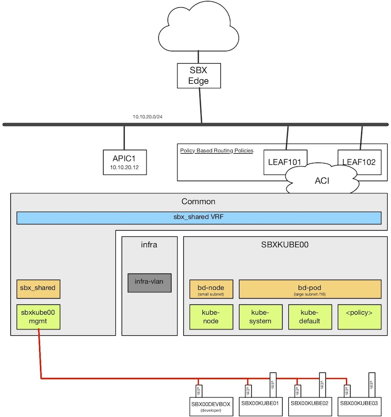

[](https://developer.cisco.com/codeexchange/github/repo/DevNetSandbox/sbx_acik8s)

# DevNet Sandbox: ACI and Kubernetes
This repository is intended to be used with the [DevNet Sandbox: ACI and Kubernetes](https://devnetsandbox.cisco.com/RM/Diagram/Index/29a5baac-bc78-4885-b4ec-83294c64bcc4?diagramType=Topology).  Each instance of this Sandbox includes everything needed to deploy a Kubernetes Cluster using the Cisco ACI CNI Plug-In allowing network, application, and security teams to deploy policies to for micro service applications and containers consistent with other systems.  


## Table of Contents

* [Auto Deployment of Kubernetes and ACI](#auto-deployment-of-kubernetes-and-aCI)
* [Sandbox Topology Details](#sandbox-topology-details)
* [Notes on the ACI tenant and base object creation](#notes-on-the-aci-tenant-and-base-object-creation)
* [Reference Links](#reference-links)
* [Quick Start Guide](quickstart.md)
* [Learning Labs](https://learninglabs.cisco.com/tracks/acik8s) 

## Auto Deployment of Kubernetes and ACI
Looking to get up and running as fast as possible?  After reserving your sandbox, you can use the [`auto_deploy.sh`](https://github.com/DevNetSandbox/sbx_acik8s/blob/master/kube_setup/auto_deploy.sh) script to setup the environment, Kubernetes, and ACI CNI plug-in automatically and be ready to deploy applications in about 5 minutes.  

### Steps

1. Connect to your sandbox via VPN, and SSH to your DevBox, or "Development Workstation"
1. Run this command to download the [`auto_deploy.sh`](https://github.com/DevNetSandbox/sbx_acik8s/blob/master/kube_setup/auto_deploy.sh) script from GitHub, and make it executable.  

    ```bash
    curl -o auto_deploy.sh \
      https://raw.githubusercontent.com/DevNetSandbox/sbx_acik8s/master/kube_setup/auto_deploy.sh \
      && chmod +x auto_deploy.sh
    ```

1. Run the script providing your 2-digit POD_NUM, POD_PASS, and the phase of `full` to complete the configurations from previous labs in the series.

    ```bash
    # Replace POD_NUM and POD_PASS in the command with the details from your lab.
    ./auto_deploy.sh POD_NUM POD_PASS full

    # Example command: ./auto_deploy.sh 00 aciaf87a full
    ```

    <details>
    <summary>Sample Output</summary>
    <pre>
    Auto Deployment of Kubernetes with ACI CNI Sandbox requested for:
      Pod Number: 00
      Pod Password: aciaf87a
    Deploy Stage: full
    Would you like to continue? [yes/no]
    yes
    Beginning Auto Deployment of Kubernetes with ACI CNI Sandbox.

    Setup DevBox with Development Tools and Repos
    done

    Create and deploy RSA keys for passwordless login to pod nodes from DevBox
    done

    Installing Kubernetes admin tools onto DevBox
    done

    Requested Phase 'full' complete.
    </pre>
    </details>    

1. Once the script complete, you can look at the contents of the file `auto_deploy.log` to see detailed output from the commands and automation executed.   

## Sandbox Topology Details
A sandbox starts with a base topology and configuration that includes the following:

* 1 Development Workstation or "devbox"
    * Network connection to the sandbox pods management network
* 3 Kuberenetes Hosts (1 master and 2 nodes)
    * Network connection to the sandbox pods management network
    * 2nd unconfigured network adapter to be used by Kubernetes
* ACI tenant and base objects for integration (details on this [below](#notes-on-the-aci-tenant-and-base-object-creation))



After deploying Kubernetes, the ACI CNI Plug-in, and Sample Applications you will have a topology that looks like this.  


> Note: These topologies are logical block drawings created to illustrate the concepts and structures underlying both Kubernetes and ACI.

By following along with the resources available for this Sandbox you will gain an understanding of how to build and work with the ACI/K8s integration.  

## Notes on the ACI tenant and base object creation
The first step in integrating ACI and Kubernetes involves using the [acc-provision]() Python tool provided by Cisco to create the foundation objects in ACI.  These include the tenant, bridge domains, epgs, etc that are shown in the initial topology above.  The execution of this tool requires Administrative rights to the APIC, something not available to your reservation account.  

During the setup of the sandbox, this tool is run for your assigned pod on your behalf.  This tool takes as input a YAML file that contains the configuration details for the integration, and it generates a Kubernetes manifest file that is used to deploy the ACI CNI components to Kubernetes once it is installed and ready.  

You can view the exact input configuration file used for the deployment in the folder for your assigned pod at [kube_setup/aci_setup/](kube_setup/aci_setup/).  It is called `aci-containers-config.yaml`.  Also within the folder is `aci-containers.yaml`. This is the Kubernetes manifest for the ACI CNI plugin that you will use during setup.  More on this in the setup steps below.  

## Reference Links
The instructions in this quick start, as well as the learning labs accompanying this Sandbox, will get you setup and work to explain the details of the what and why each step is done.  The authors of this content used the following resources in setting up the Sandbox and instructions.  If you are looking for more details or explanations, these are great resources to start with.  

* [Cisco ACI and Kubernetes Integration](https://www.cisco.com/c/en/us/td/docs/switches/datacenter/aci/apic/sw/kb/b_Kubernetes_Integration_with_ACI.html)
* [Kubernetes/Open Shift Troubleshooting cheat sheet](https://techzone.cisco.com/t5/Application-Centric/Kubernetes-Open-Shift-Troubleshooting-cheat-sheet/ta-p/1192315)
* [Installing kubeadm](https://kubernetes.io/docs/tasks/tools/install-kubeadm/)
* [Using kubeadm to Create a Cluster](https://kubernetes.io/docs/setup/independent/create-cluster-kubeadm/)


# Quick Start Guide
Looking to get started as quickly as possible?  Well checkout the [Quick Start Guide](quickstart.md).
