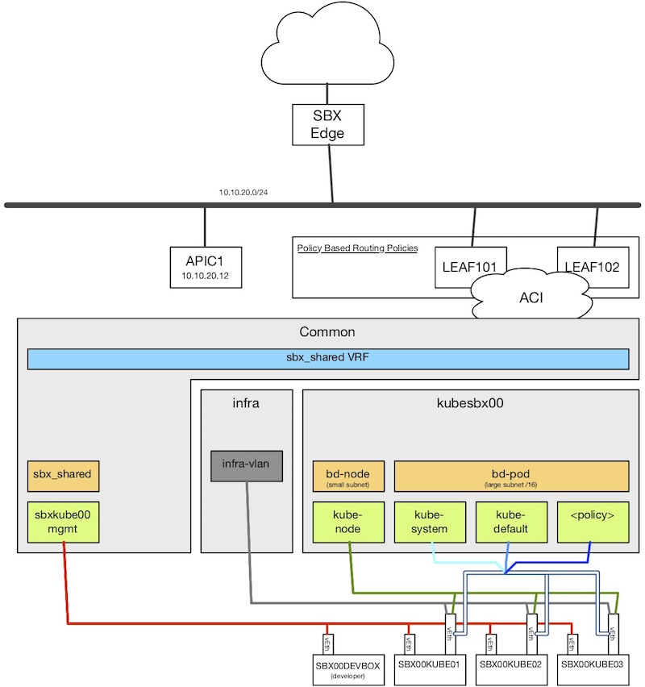
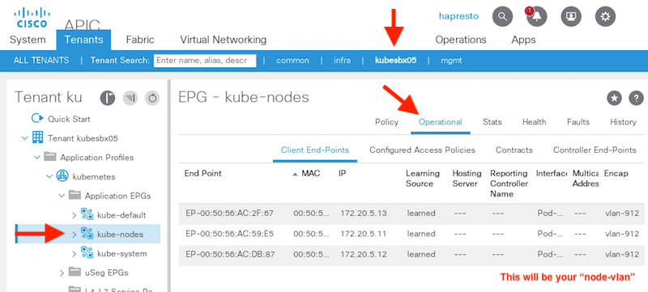
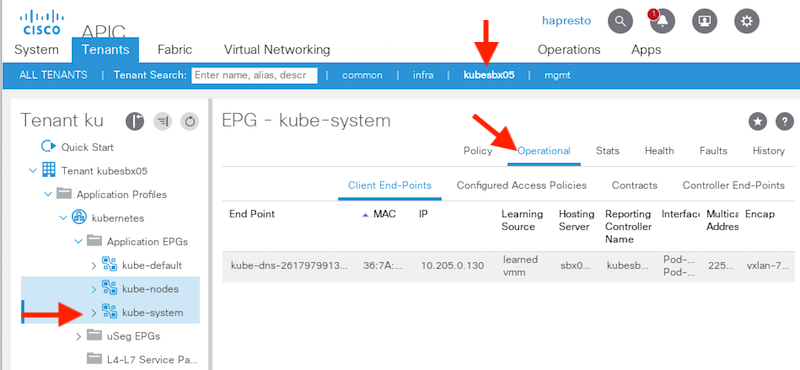
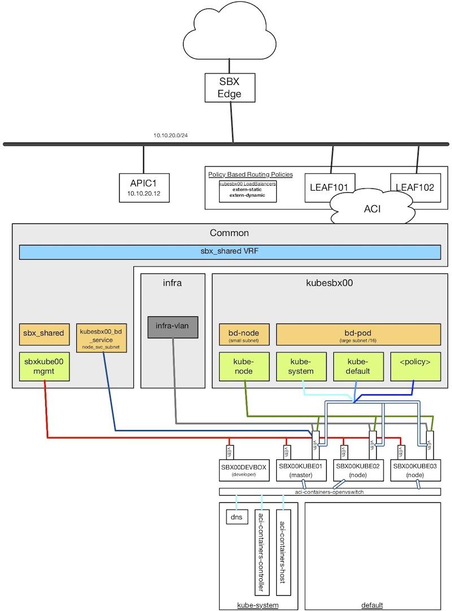
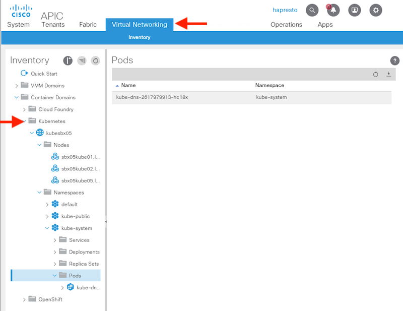
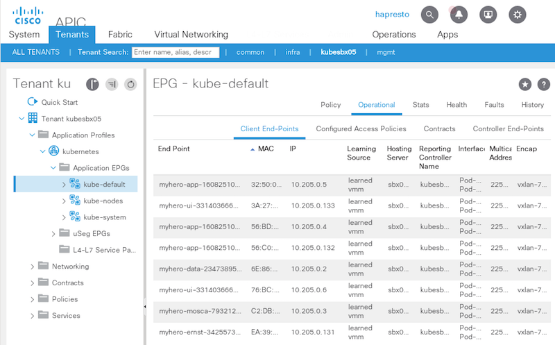

# ACI/Kubernetes Quick Start Guide
Follow the below steps to quickly configure and deploy Kubernetes with the ACI CNI plug-in using provided scripts and Ansible playbooks within this repository.  Details about what each step is accomplishing is listed before the command and instructions to complete.  

For a manually, detailed walkthrough of the setup you can complete the [Learning Lab](https://devnetsandbox.cisco.com/RM/Diagram/Index/29a5baac-bc78-4885-b4ec-83294c64bcc4?diagramType=Topology), or read through the docs listed in the reference section.  

# Table of Contents

* [Connecting to your Sandbox](#connecting-to-your-sandbox)
* [Preparing your Development Workstation](#preparing-your-development-workstation)
* [Kubernetes Node Network Preparation](#kubernetes-node-network-preparation)
* [Kubernetes Node Prerequisite Installation](#kubernetes-node-prerequisite-installation)
* [Kubernetes Installation](#kubernetes-installation)
* [Deploy and Test Your First Applications](#deploy-and-test-your-first-applications)
* [Resetting Kubernetes in Your Pod](#resetting-kubernetes-in-your-pod)
* [Next Steps](#next-steps)

## Connecting to your Sandbox
After reserving your sandbox, you will receive and email that contains the details about your reserved pod.  Be sure to make note of the following details as you'll need them to get connected and successfully provision your pod.  

| Info | Purpose |
| --- | --- |
| VPN Network Address | Used to establish VPN with AnyConnect or OpenConnect to your pod |
| VPN Username | Used to establish VPN with AnyConnect or OpenConnect to your pod |
| VPN Password | Used to establish VPN with AnyConnect or OpenConnect to your pod |
| Sandbox Pod ID | The specific sandbox pod that you've been assigned.  You'll need to know this ID to find and use the correct configuration details and commands. This id is referred to throughout the steps. |
| Development Workstation | The IP of your "devbox".  This should be your primary workstation for setting up and operating Kubernetes. You can SSH to this IP address. The username is "developer".  The password is the same as your VPN password. |
| Kubernetes Master | The IP of the host that will become your Kubernetes master. You'll be able to SSH directly to it over the VPN initially, however during the Kubernetes network preparation the routing will update making it only possible to SSH to this host from the DevBox. |
| Kubernetes Node 1 | The IP of the host that will become your first Kubernetes node. You'll be able to SSH directly to it over the VPN initially, however during the Kubernetes network preparation the routing will update making it only possible to SSH to this host from the DevBox. |
| Kubernetes Node 2 | The IP of the host that will become your second Kubernetes node. You'll be able to SSH directly to it over the VPN initially, however during the Kubernetes network preparation the routing will update making it only possible to SSH to this host from the DevBox. |
| ACI Fabric Address | The APIC Controller for your pod. |
| ACI Tenant | The ACI tenant that your sandbox and cluster will use.  This was created during provisioning by the `acc-provision` tool (see note above). You have full administrative access to this tenant. |
| APIC Username | The credentials to log into the APIC with.  These credentials give you admin access to your tenant and read access to other relevant parts of the fabric. |
| APIC Password | The credentials to log into the APIC with.  These credentials give you admin access to your tenant and read access to other relevant parts of the fabric. |

1. With this information, establish a VPN to your pod and log into your Development Workstation (devbox) with SSH.  

    ```bash
    $ ssh developer@172.20.0.120
    [developer@sbx05devbox ~]$
    ```

1. Connect to the APIC Controller using your credentials.  Verify that you see the APIC Tenant created.  

    

## Preparing your Development Workstation
### aka "devbox"
You'll be executing all the configuration and installation steps from the devbox.  To show the full steps needed to do the setup, the devbox starts as a minimal installation of CentOS 7.  Let's install the needed tooling that we'll be using.  

<!--
### Optional Steps
* Python 2.7.15 and 3.6
-->

1. Install basic Linux tools.  

    ```bash
    sudo yum install -y wget git
    ```

1. Install Python package and environment utilities.  

    ```bash
    wget https://bootstrap.pypa.io/get-pip.py
    sudo python get-pip.py
    sudo pip install virtualenv
    ```

1. Clone down this repository to the devbox.

    ```bash
    git clone https://github.com/DevNetSandbox/sbx_acik8s
    cd sbx_acik8s
    ```

1. Create and activate a virtual environment for this project.  

    ```bash
    virtualenv venv
    source venv/bin/activate
    ```

1. Install the `kube_setup/requirements.txt`.  (Primarily Ansible)

    ```bash
    pip install -r kube_setup/requirements.txt
    ```

1. Create an SSH key that will be used to log into your hosts without needing a password.  Both convenient and required for Ansible to work.  Just take all the defaults.  

    ```bash
    ssh-keygen
    ```

    <details>
    <summary>Sample Output</summary>
    <pre>
    Generating public/private rsa key pair.
    Enter file in which to save the key (/home/developer/.ssh/id_rsa):
    Enter passphrase (empty for no passphrase):
    Enter same passphrase again:
    Your identification has been saved in /home/developer/.ssh/id_rsa.
    Your public key has been saved in /home/developer/.ssh/id_rsa.pub.
    The key fingerprint is:
    SHA256:55S+J66N+u15ACZdLUp2gdTZEE4xcXli4EFV+suKtA0 developer@sbx05devbox.localdomain
    The key's randomart image is:
    +---[RSA 2048]----+
    |       ..+%%oo.  |
    |        ++*+*..  |
    |       + +oo.o   |
    |      . =  . .   |
    |       oS.+   .  |
    |         =.  . . |
    |          E.  o  |
    |         =.Bo.   |
    |      .o++X+o    |
    +----[SHA256]-----+
    </pre>
    </details>


1. Copy the key to all your hosts, including back onto the devbox itself.  **Note: Use the IPs for your hosts**

    ```bash
    # Example command.  Repeat 4 times, once for each host
    ssh-copy-id developer@<HOST IP>

    # Note, you'll need to provide the password assigned to your pod
    ```

1. Test that you can now SSH from the DevBox to all your hosts without entering a password.  

    ```bash
    # Example
    ssh developer@<HOST IP>
    ```

1. Change into the `kube_setup` directory.

    ```bash
    cd kube_setup
    ```

1. Run the the Ansible Playbook [`kube_devbox_setup.yml`](kube_setup/kube_devbox_setup.yml) to install the Kubernetes command line tool, `kubectl` on the DevBox.  You'll need to reference the correct [inventory file](kube_setup/inventory/) for your assigned pod or you will error.  
    * *If you get an error about authentication, be sure to have copied the SSH key back onto the DevBox itself.*  

    ```bash
    # Replace ?? with your pod ID number
    ansible-playbook -i inventory/sbx??-hosts kube_devbox_setup.yml
    ```

    <details>
    <summary>Sample Output</summary>
    <pre>
    PLAY [Management Tools] *********************************************************************************

    TASK [Gathering Facts] **********************************************************************************
    ok: [devbox]

    TASK [Add Kubernetes Repo to yum] ***********************************************************************
    changed: [devbox]

    TASK [Install Kubernetes tools] *************************************************************************
    changed: [devbox] => (item=[u'kubectl-1.7.15-0'])

    PLAY RECAP **********************************************************************************************
    devbox                     : ok=3    changed=2    unreachable=0    failed=0   
    </pre>
    </details>


## Kubernetes Node Network Preparation
Before you can install Kubernetes on your hosts, you'll need to configure the networking within Linux to provide the connectivity paths into the ACI tenant and objects that were created by `acc-provision`.  The topology you'll be creating in this step looks like this.  



This step involves creating and customizing the Linux configuration files related to the network, particularly to the adapter `ens224` that is present on all three of your Kubernetes hosts.  The steps involved are:

1. Create the `/etc/sysconfig/network-scripts/ifcfg-ens224` configuration file setting up the interface MTU and as a trunk interface for VLANs and VXLAN encapsulated packets
1. Creating a sub-interface on ens224 for the `kube-node` network.  This will be leveraged as the main Kubernetes API interface.  This will leverage the `node-vlan` for your pod identified in the `aci-containers-config.yaml` file that was used by `acc-provision`.  **This network is represented by the olive green line in the topology.**
1. Creating a sub-interface on ens224 for the `infra-vlan` that will allow the ACI fabric to be extended into the host. **This network is represented by the gray line in the topology.**
1. Setting up a DHCP client for the infra-vlan interface.
1. Adding a multi-cast route for the fabric
1. Updating the default route for the hosts to use the new "node interface" for traffic.  *After this step you will only be able to access the mgmt interfaces on the Kubernetes nodes from the DevBox*

### Configure the Networking with Ansible

1. Use the Ansible playbook `kube_network_prep.yaml` to configure the Kubernetes hosts.  ***You'll need to reference the correct [inventory file](kube_setup/inventory/) for your assigned pod or you will error.***
    * *If you get an error about authentication, be sure to have copied the SSH key back onto the DevBox itself.*
    * *Note: The "Restart Network steps can take several seconds to complete."*

    ```bash
    # Replace ?? with your pod ID number
    ansible-playbook -i inventory/sbx??-hosts kube_network_prep.yaml
    ```

    <details>
    <summary>Sample Output</summary>
    <pre>
    ansible-playbook -i inventory/sbx05-hosts kube_network_prep.yaml
     [WARNING]: Found both group and host with same name: devbox


    PLAY [Configure Network Interface for K8s to ACI] *******************************************************

    TASK [Gathering Facts] **********************************************************************************
    ok: [kube03]
    ok: [kube01]
    ok: [kube02]

    TASK [Create Ethernet Configuration File] ***************************************************************
    changed: [kube03]
    changed: [kube01]
    changed: [kube02]

    TASK [Create Node VLAN Interface] ***********************************************************************
    changed: [kube01]
    changed: [kube03]
    changed: [kube02]

    TASK [Create Infra VLAN Interface] **********************************************************************
    changed: [kube01]
    changed: [kube03]
    changed: [kube02]

    TASK [Restart Network] **********************************************************************************
    changed: [kube01]
    changed: [kube03]
    changed: [kube02]

    TASK [Re-query facts for new interfaces] ****************************************************************
    ok: [kube01]
    ok: [kube03]
    ok: [kube02]

    TASK [Create DHCP Client Configuration for Infra] *******************************************************
    changed: [kube01]
    changed: [kube03]
    changed: [kube02]

    TASK [Add Fabric Multicast Subnet Route] ****************************************************************
    changed: [kube01]
    changed: [kube03]
    changed: [kube02]

    TASK [Remove Default Route from Mgmt Interface, pt1] ****************************************************
    changed: [kube02] => (item=DEFROUTE=no)
    changed: [kube01] => (item=DEFROUTE=no)
    changed: [kube03] => (item=DEFROUTE=no)
    changed: [kube02] => (item=#GATEWAY=172.20.0.1)
    changed: [kube03] => (item=#GATEWAY=172.20.0.1)
    changed: [kube01] => (item=#GATEWAY=172.20.0.1)

    TASK [Remove Default Route from Mgmt Interface, pt2] ****************************************************
    changed: [kube02] => (item=DEFROUTE=yes)
    changed: [kube01] => (item=DEFROUTE=yes)
    changed: [kube03] => (item=DEFROUTE=yes)
    changed: [kube02] => (item=GATEWAY=172.20.0.1)
    changed: [kube01] => (item=GATEWAY=172.20.0.1)
    changed: [kube03] => (item=GATEWAY=172.20.0.1)

    TASK [Restart Network] **********************************************************************************
    changed: [kube02]
    changed: [kube01]
    changed: [kube03]

    PLAY RECAP **********************************************************************************************
    kube01                     : ok=11   changed=9    unreachable=0    failed=0   
    kube02                     : ok=11   changed=9    unreachable=0    failed=0   
    kube03                     : ok=11   changed=9    unreachable=0    failed=0  
    </pre>
    </details>


1. You can verify the configuration on one of the hosts to see the new network configuration.  
    1. SSH to one of your Kubernetes hosts.  *Be sure to use the IP for one of your nodes.*

        ```bash
        ssh developer@172.20.0.121
        Last login: Wed Jun  6 10:17:11 2018 from 172.20.0.120
        [developer@sbx05kube01 ~]$
        ```

    1. Run the following commands to inspect the network configuration.  ***NOTE: The specific IPs and VLANs referenced will differ depending on the POD-ID you are assigned.***

        ```bash
        ip link
        ip address
        ip route
        ```

        <details>
        <summary>Sample Output</summary>
        <pre>
        [developer@sbx05kube01 ~]$ ip link    
        1: lo: <LOOPBACK,UP,LOWER_UP> mtu 65536 qdisc noqueue state UNKNOWN mode DEFAULT qlen 1
            link/loopback 00:00:00:00:00:00 brd 00:00:00:00:00:00
        2: ens192: <BROADCAST,MULTICAST,UP,LOWER_UP> mtu 1500 qdisc mq state UP mode DEFAULT qlen 1000
            link/ether 00:50:56:ac:f9:79 brd ff:ff:ff:ff:ff:ff
        3: ens224: <BROADCAST,MULTICAST,UP,LOWER_UP> mtu 1600 qdisc mq state UP mode DEFAULT qlen 1000
            link/ether 00:50:56:ac:59:e5 brd ff:ff:ff:ff:ff:ff
        6: ens224.4093@ens224: <BROADCAST,MULTICAST,UP,LOWER_UP> mtu 1600 qdisc noqueue state UP mode DEFAULT qlen 1000
            link/ether 00:50:56:ac:59:e5 brd ff:ff:ff:ff:ff:ff
        7: ens224.912@ens224: <BROADCAST,MULTICAST,UP,LOWER_UP> mtu 1600 qdisc noqueue state UP mode DEFAULT qlen 1000
            link/ether 00:50:56:ac:59:e5 brd ff:ff:ff:ff:ff:ff

        [developer@sbx05kube01 ~]$ ip address    
        1: lo: <LOOPBACK,UP,LOWER_UP> mtu 65536 qdisc noqueue state UNKNOWN qlen 1
            link/loopback 00:00:00:00:00:00 brd 00:00:00:00:00:00
            inet 127.0.0.1/8 scope host lo
               valid_lft forever preferred_lft forever
            inet6 ::1/128 scope host
               valid_lft forever preferred_lft forever
        2: ens192: <BROADCAST,MULTICAST,UP,LOWER_UP> mtu 1500 qdisc mq state UP qlen 1000
            link/ether 00:50:56:ac:f9:79 brd ff:ff:ff:ff:ff:ff
            inet 172.20.0.121/24 brd 172.20.0.255 scope global ens192
               valid_lft forever preferred_lft forever
            inet6 fe80::f04a:f78d:1f78:aa4e/64 scope link
               valid_lft forever preferred_lft forever
            inet6 fe80::6307:f501:3b05:bbdc/64 scope link tentative dadfailed
               valid_lft forever preferred_lft forever
            inet6 fe80::ae83:e109:1bf0:bbd0/64 scope link tentative dadfailed
               valid_lft forever preferred_lft forever
        3: ens224: <BROADCAST,MULTICAST,UP,LOWER_UP> mtu 1600 qdisc mq state UP qlen 1000
            link/ether 00:50:56:ac:59:e5 brd ff:ff:ff:ff:ff:ff
            inet6 fe80::250:56ff:feac:59e5/64 scope link
               valid_lft forever preferred_lft forever
        6: ens224.4093@ens224: <BROADCAST,MULTICAST,UP,LOWER_UP> mtu 1600 qdisc noqueue state UP qlen 1000
            link/ether 00:50:56:ac:59:e5 brd ff:ff:ff:ff:ff:ff
            inet 10.0.216.64/16 brd 10.0.255.255 scope global dynamic ens224.4093
               valid_lft 604551sec preferred_lft 604551sec
            inet6 fe80::250:56ff:feac:59e5/64 scope link
               valid_lft forever preferred_lft forever
        7: ens224.912@ens224: <BROADCAST,MULTICAST,UP,LOWER_UP> mtu 1600 qdisc noqueue state UP qlen 1000
            link/ether 00:50:56:ac:59:e5 brd ff:ff:ff:ff:ff:ff
            inet 172.20.5.11/26 brd 172.20.5.63 scope global ens224.912
               valid_lft forever preferred_lft forever
            inet6 fe80::250:56ff:feac:59e5/64 scope link
               valid_lft forever preferred_lft forever

        [developer@sbx05kube01 ~]$ ip route
        default via 172.20.5.1 dev ens224.912 proto static metric 400
        10.0.0.0/16 dev ens224.4093 proto kernel scope link src 10.0.216.64
        169.254.0.0/16 dev ens224.4093 scope link metric 1006
        172.20.0.0/24 dev ens192 proto kernel scope link src 172.20.0.121 metric 100
        172.20.5.0/26 dev ens224.912 proto kernel scope link src 172.20.5.11 metric 400
        224.0.0.0/4 dev ens224.4093 scope link
        </pre>
        </details>    

1. You can also verify the initial network configuration from the APIC.  You should now see the hosts as entries in the Operational list for the `kube-nodes` EPG.  

    

## Kubernetes Node Prerequisite Installation
With the network configured correctly on your hosts, you can now install the Kubernetes pre-reqs and tooling onto each of your Kubernetes hosts.  In this step the following will be done.  

1. Install Docker
2. Add Kubernetes Repository to YUM
3. Install Kubernetes tools
    * kubernetes-cni
    * kubelet
    * kubeadm
    * kubectl
4. Make needed networking and configuration fixes for Kubernetes.  For details, see the Kubernetes docs referenced.

### Install Pre-Reqs with Ansible

1. Use the Ansible Playbook `kube_prereq_install.yml` to prepare your hosts.  ***You'll need to reference the correct [inventory file](kube_setup/inventory/) for your assigned pod or you will error.***
    * *If you get an error about authentication, be sure to have copied the SSH key back onto the DevBox itself.*
    * *Note: The "Restart Network steps can take several seconds to complete."*

    ```bash
    # Replace ?? with your pod ID number
    ansible-playbook -i inventory/sbx??-hosts kube_prereq_install.yml
    ```

    <details>
    <summary>Sample Output</summary>
    <pre>
    PLAY [Step 1] *******************************************************************************************

    TASK [Gathering Facts] **********************************************************************************
    ok: [kube02]
    ok: [kube03]
    ok: [kube01]

    TASK [docker : Remove previous docker installation] *****************************************************
    ok: [kube01] => (item={u'package': u'docker'})
    ok: [kube02] => (item={u'package': u'docker'})
    ok: [kube03] => (item={u'package': u'docker'})
    ok: [kube01] => (item={u'package': u'docker-common'})
    ok: [kube02] => (item={u'package': u'docker-common'})
    ok: [kube03] => (item={u'package': u'docker-common'})
    ok: [kube01] => (item={u'package': u'docker-client'})
    ok: [kube02] => (item={u'package': u'docker-client'})
    ok: [kube03] => (item={u'package': u'docker-client'})
    ok: [kube01] => (item={u'package': u'docker-engine'})
    ok: [kube02] => (item={u'package': u'docker-engine'})
    ok: [kube03] => (item={u'package': u'docker-engine'})

    TASK [docker : Import Docker CE repository gpg key] *****************************************************
    changed: [kube01]
    changed: [kube02]
    changed: [kube03]

    TASK [docker : Add Docker CE repository] ****************************************************************
    changed: [kube01]
    changed: [kube03]
    changed: [kube02]

    TASK [docker : Install Docker CE] ***********************************************************************
    changed: [kube01]
    changed: [kube03]
    changed: [kube02]

    TASK [docker : Start docker] ****************************************************************************
    changed: [kube01]
    changed: [kube03]
    changed: [kube02]

    TASK [docker : Check Docker compose bin file presence] **************************************************
    ok: [kube02]
    ok: [kube01]
    ok: [kube03]

    TASK [docker : Install docker compose] ******************************************************************
     [WARNING]: Consider using the get_url or uri module rather than running curl.  If you need to use
    command because get_url or uri is insufficient you can add warn=False to this command task or set
    command_warnings=False in ansible.cfg to get rid of this message.

    changed: [kube02]
    changed: [kube03]
    changed: [kube01]

    TASK [docker : Apply executable permission] *************************************************************
    changed: [kube02]
    changed: [kube03]
    changed: [kube01]

    TASK [docker : Test docker-compose version] *************************************************************
    fatal: [kube02]: FAILED! => {"changed": true, "cmd": "docker-compose --version", "delta": "0:00:00.003315", "end": "2018-06-06 10:38:40.395337", "msg": "non-zero return code", "rc": 127, "start": "2018-06-06 10:38:40.392022", "stderr": "/bin/sh: docker-compose: command not found", "stderr_lines": ["/bin/sh: docker-compose: command not found"], "stdout": "", "stdout_lines": []}
    ...ignoring
    fatal: [kube01]: FAILED! => {"changed": true, "cmd": "docker-compose --version", "delta": "0:00:00.003544", "end": "2018-06-06 10:38:51.381174", "msg": "non-zero return code", "rc": 127, "start": "2018-06-06 10:38:51.377630", "stderr": "/bin/sh: docker-compose: command not found", "stderr_lines": ["/bin/sh: docker-compose: command not found"], "stdout": "", "stdout_lines": []}
    ...ignoring
    fatal: [kube03]: FAILED! => {"changed": true, "cmd": "docker-compose --version", "delta": "0:00:00.003413", "end": "2018-06-06 10:38:41.411160", "msg": "non-zero return code", "rc": 127, "start": "2018-06-06 10:38:41.407747", "stderr": "/bin/sh: docker-compose: command not found", "stderr_lines": ["/bin/sh: docker-compose: command not found"], "stdout": "", "stdout_lines": []}
    ...ignoring

    PLAY [Step 2] *******************************************************************************************

    TASK [Gathering Facts] **********************************************************************************
    ok: [kube03]
    ok: [kube01]
    ok: [kube02]

    TASK [Add Kubernetes Repo to yum] ***********************************************************************
    changed: [kube01]
    changed: [kube03]
    changed: [kube02]

    TASK [Install Kubernetes tools] *************************************************************************
    changed: [kube01] => (item=[u'kubernetes-cni-0.5.1-1', u'kubelet-1.7.15-0', u'kubeadm-1.7.15-0', u'kubectl-1.7.15-0'])
    changed: [kube03] => (item=[u'kubernetes-cni-0.5.1-1', u'kubelet-1.7.15-0', u'kubeadm-1.7.15-0', u'kubectl-1.7.15-0'])
    changed: [kube02] => (item=[u'kubernetes-cni-0.5.1-1', u'kubelet-1.7.15-0', u'kubeadm-1.7.15-0', u'kubectl-1.7.15-0'])

    TASK [IP Tables Fix] ************************************************************************************
    changed: [kube03] => (item=net.bridge.bridge-nf-call-ip6tables = 1)
    changed: [kube02] => (item=net.bridge.bridge-nf-call-ip6tables = 1)
    changed: [kube01] => (item=net.bridge.bridge-nf-call-ip6tables = 1)
    changed: [kube03] => (item=net.bridge.bridge-nf-call-iptables = 1)
    changed: [kube02] => (item=net.bridge.bridge-nf-call-iptables = 1)
    changed: [kube01] => (item=net.bridge.bridge-nf-call-iptables = 1)
    changed: [kube03] => (item=net.ipv4.ip_forward = 1)
    changed: [kube02] => (item=net.ipv4.ip_forward = 1)
    changed: [kube01] => (item=net.ipv4.ip_forward = 1)

    TASK [Start kubelet] ************************************************************************************
    changed: [kube01]
    changed: [kube03]
    changed: [kube02]

    TASK [Fix cgroup driver] ********************************************************************************
    changed: [kube03]
    changed: [kube02]
    changed: [kube01]

    TASK [Reload systemctl daemon] **************************************************************************
    changed: [kube01]
    changed: [kube02]
    changed: [kube03]

    TASK [Restart kubelet] **********************************************************************************
    changed: [kube01]
    changed: [kube02]
    changed: [kube03]

    TASK [Open ports for Kubernetes] ************************************************************************
    changed: [kube02] => (item=6443)
    changed: [kube01] => (item=6443)
    changed: [kube03] => (item=6443)
    changed: [kube02] => (item=10250)
    changed: [kube03] => (item=10250)
    changed: [kube01] => (item=10250)

    TASK [Disable firewalld] ********************************************************************************
    changed: [kube01]
    changed: [kube03]
    changed: [kube02]

    PLAY RECAP **********************************************************************************************
    kube01                     : ok=20   changed=16   unreachable=0    failed=0   
    kube02                     : ok=20   changed=16   unreachable=0    failed=0   
    kube03                     : ok=20   changed=16   unreachable=0    failed=0
    </pre>
    </details>

## Kubernetes Installation
You are now ready to install Kubernetes onto your hosts.  During this phase you'll be executing a series of commands using the Kubernetes tooling.  To make it simpler there is a "Command Reference" included within this repository ([kube\_setup/command\_references/](kube_setup/command_references/)) with the exact commands you'll need to type for your pod.  You can open the file for your assigned pod to make it easier to execute the commands using the correct IPs and sandbox specific information.  

1. From the devbox, SSH to your master node.

    ```bash
    ssh developer@<IP-FOR-KUBERNETES-MASTER>
    ```

1. Use `kubeadm` to initialize a new cluster by setting up your **sbx??kube01** host as a "master".
    * ***In the command you'll need to provide your POD-ID number within the IP addresses.  Be sure to include leading `0` in pods with an id <10.***

    ```bash
    sudo kubeadm init \
      --pod-network-cidr=10.2<POD-ID>.0.1/16 \
      --service-cidr=192.168.2<POD-ID>.1/24 \
      --apiserver-advertise-address=172.20.<POD-ID>.11
    ```

    ```bash
    # Example command for Pod-ID 05
    sudo kubeadm init \
      --pod-network-cidr=10.205.0.1/16 \
      --service-cidr=192.168.205.1/24 \
      --apiserver-advertise-address=172.20.5.11
    ```

    > Reminder to use the command_reference file for your pod

    <details>
    <summary>Sample Output</summary>
    <pre>
    [kubeadm] WARNING: kubeadm is in beta, please do not use it for production clusters.
    [init] Using Kubernetes version: v1.7.16
    [init] Using Authorization modes: [Node RBAC]
    [preflight] Running pre-flight checks
    [preflight] WARNING: docker version is greater than the most recently validated version. Docker version: 18.03.1-ce. Max validated version: 1.12
    [preflight] WARNING: hostname "sbx05kube01.localdomain" could not be reached
    [preflight] WARNING: hostname "sbx05kube01.localdomain" lookup sbx05kube01.localdomain on 208.67.220.220:53: no such host
    [preflight] Starting the kubelet service
    [kubeadm] WARNING: starting in 1.8, tokens expire after 24 hours by default (if you require a non-expiring token use --token-ttl 0)
    [certificates] Generated CA certificate and key.
    [certificates] Generated API server certificate and key.
    [certificates] API Server serving cert is signed for DNS names [sbx05kube01.localdomain kubernetes kubernetes.default kubernetes.default.svc kubernetes.default.svc.cluster.local] and IPs [192.168.205.1 172.20.5.11]
    [certificates] Generated API server kubelet client certificate and key.
    [certificates] Generated service account token signing key and public key.
    [certificates] Generated front-proxy CA certificate and key.
    [certificates] Generated front-proxy client certificate and key.
    [certificates] Valid certificates and keys now exist in "/etc/kubernetes/pki"
    [kubeconfig] Wrote KubeConfig file to disk: "/etc/kubernetes/admin.conf"
    [kubeconfig] Wrote KubeConfig file to disk: "/etc/kubernetes/kubelet.conf"
    [kubeconfig] Wrote KubeConfig file to disk: "/etc/kubernetes/controller-manager.conf"
    [kubeconfig] Wrote KubeConfig file to disk: "/etc/kubernetes/scheduler.conf"
    [apiclient] Created API client, waiting for the control plane to become ready
    [apiclient] All control plane components are healthy after 30.001585 seconds
    [token] Using token: f600ca.5daf10d62f3ddfa9
    [apiconfig] Created RBAC rules
    [addons] Applied essential addon: kube-proxy
    [addons] Applied essential addon: kube-dns

    Your Kubernetes master has initialized successfully!

    To start using your cluster, you need to run (as a regular user):

      mkdir -p $HOME/.kube
      sudo cp -i /etc/kubernetes/admin.conf $HOME/.kube/config
      sudo chown $(id -u):$(id -g) $HOME/.kube/config

    You should now deploy a pod network to the cluster.
    Run "kubectl apply -f [podnetwork].yaml" with one of the options listed at:
      http://kubernetes.io/docs/admin/addons/

    You can now join any number of machines by running the following on each node
    as root:

      kubeadm join --token f600ca.5daf10d62f3ddfa9 172.20.5.11:6443
    </pre>
    </details>

1. At the end of the master setup you will see a message similar to the following.  This provides **the exact command** you'll need to join the nodes to the cluster.  This command includes a TOKEN that is needed to authenticate to the master.  Copy this command some place safe so you have it when needed.  

    ```bash
    # Example output
    kubeadm join --token f600ca.5daf10d62f3ddfa9 172.20.5.11:6443
    ```

1. Still on your master node, run the following commands to configure `kubectl` to use a configuration file for your new cluster.  

    ```bash
    mkdir -p $HOME/.kube
    sudo cp -i /etc/kubernetes/admin.conf $HOME/.kube/config
    sudo chown $(id -u):$(id -g) $HOME/.kube/config
    ```

    * Verify it worked by running this command.  

        ```bash
        kubectl get nodes
        ```    
        <details>
        <summary>Sample Output</summary>
        <pre>
        NAME                      STATUS     AGE       VERSION
        sbx05kube01.localdomain   NotReady   3m        v1.7.15
        </pre>
        </details>

1. Disconnect from your Kubernetes master and return to the devbox.  
1. SSH to your Kubernetes Node 1 (ie `sbx??kube02`).
1. Using `sudo`, run the commmand to join the node to your cluster.  *You copied this command from the output of kubeadm on your master*.

    ```bash
    # Example Command - don't use this one.. you need your own token
    sudo kubeadm join --token f600ca.5daf10d62f3ddfa9 172.20.5.11:6443
    ```

    <details>
    <summary>Sample Output</summary>
    <pre>
    [kubeadm] WARNING: kubeadm is in beta, please do not use it for production clusters.
    [preflight] Running pre-flight checks
    [preflight] WARNING: docker version is greater than the most recently validated version. Docker version: 18.03.1-ce. Max validated version: 1.12
    [preflight] WARNING: hostname "sbx05kube02.localdomain" could not be reached
    [preflight] WARNING: hostname "sbx05kube02.localdomain" lookup sbx05kube02.localdomain on 208.67.220.220:53: no such host
    [discovery] Trying to connect to API Server "172.20.5.11:6443"
    [discovery] Created cluster-info discovery client, requesting info from "https://172.20.5.11:6443"
    [discovery] Cluster info signature and contents are valid, will use API Server "https://172.20.5.11:6443"
    [discovery] Successfully established connection with API Server "172.20.5.11:6443"
    [bootstrap] Detected server version: v1.7.16
    [bootstrap] The server supports the Certificates API (certificates.k8s.io/v1beta1)
    [csr] Created API client to obtain unique certificate for this node, generating keys and certificate signing request
    [csr] Received signed certificate from the API server, generating KubeConfig...
    [kubeconfig] Wrote KubeConfig file to disk: "/etc/kubernetes/kubelet.conf"

    Node join complete:
    * Certificate signing request sent to master and response
      received.
    * Kubelet informed of new secure connection details.

    Run 'kubectl get nodes' on the master to see this machine join.
    </pre>
    </details>

1. Disconnect from Node 1, and repeat on Node 2.
1. Back on your devbox, now we'll configure `kubectl` to communicate with the cluster.  Run the following commands on the devbox.  ***Be sure to update to use the IP address for your Kubernetes Master.  You can also refer to your command reference***

    ```bash
    mkdir -p $HOME/.kube
    scp developer@<KUBERNETES-MASTER-IP>:.kube/config $HOME/.kube/config
    ```

1. Test that `kubectl` is working from the devbox.

    ```bash
    kubectl get nodes
    ```

    <details>
    <summary>Sample Output</summary>
    <pre>
    NAME                      STATUS     AGE       VERSION
    sbx05kube01.localdomain   NotReady   15m       v1.7.15
    sbx05kube02.localdomain   NotReady   9m        v1.7.15
    sbx05kube05.localdomain   NotReady   7m        v1.7.15
    </pre>
    </details>

1. Kubernetes is now installed, but as displayed in the output, the nodes are "NotReady".  This is because Kubernetes does NOT include a networking configuration by default.  Next we can install the ACI CNI Plug-in.  
1. You install a CNI plug-in by applying the Kubernetes "manifest" (application definition) for the plugin.  The ACI CNI manifest is created by `acc-provision` when it prepares the ACI fabric.  As mentioned previously, that step was done for you because it requires Admin rights to the fabric.  The generated manifest file (as well as the configuration file for `acc-provision`) are located in the your pods folder within [`kube_setup/aci_setup/`](kube_setup/aci_setup/).  
1. On the devbox, navigate to your pods folder under aci_setup. The file `aci-containers.yaml` is the manifest file you'll deploy.  

    ```bash
    cd kube_setup/aci_setup/sbx??
    ls -l
    ```

    <details>
    <summary>Sample Output</summary>
    <pre>
    (venv) [developer@sbx05devbox kube_setup]$ cd aci_setup/sbx05
    (venv) [developer@sbx05devbox sbx05]$ ls -l
    total 20
    -rw-rw-r-- 1 developer developer  2388 Jun  6 09:05 Application Centric Infrastructurecontainers-config.yaml
    -rw-rw-r-- 1 developer developer 14788 Jun  6 09:05 Application Centric Infrastructurecontainers.yaml
    </pre>
    </details>

1. **Ensuring that you are in the folder for your assigned pod**, run this command to apply the ACI CNI to Kubernetes.  

    ```bash
    kubectl apply -f aci-containers.yaml
    ```

    <details>
    <summary>Sample Output</summary>
    <pre>
    configmap "aci-containers-config" created
    secret "aci-user-cert" created
    serviceaccount "aci-containers-controller" created
    serviceaccount "aci-containers-host-agent" created
    clusterrole "aci-containers:controller" created
    clusterrole "aci-containers:host-agent" created
    clusterrolebinding "aci-containers:controller" created
    clusterrolebinding "aci-containers:host-agent" created
    daemonset "aci-containers-host" created
    daemonset "aci-containers-openvswitch" created
    deployment "aci-containers-controller" created
    </pre>
    </details>

1. Run this command to verify that the plug-in was deployed successfully.  Verify that you see the same pods deployed.  ***The exact names of the pods will differ based on the random ids added***
    * If they aren't "Running", wait a few seconds and try the command again.  All should come up to "Running."

    ```bash
    kubectl get pods --all-namespaces
    ```

    <details>
    <summary>Sample Output</summary>
    <pre>
    NAMESPACE     NAME                                              READY     STATUS    RESTARTS   AGE
    kube-system   aci-containers-controller-3029831268-2zlqg        1/1       Running   0          45s
    kube-system   aci-containers-host-2nc52                         3/3       Running   0          45s
    kube-system   aci-containers-host-kxrp1                         3/3       Running   0          45s
    kube-system   aci-containers-host-rkvgt                         3/3       Running   0          45s
    kube-system   aci-containers-openvswitch-lzz31                  1/1       Running   0          45s
    kube-system   aci-containers-openvswitch-qlwkw                  1/1       Running   0          45s
    kube-system   aci-containers-openvswitch-vc68z                  1/1       Running   0          45s
    kube-system   etcd-sbx05kube01.localdomain                      1/1       Running   0          24m
    kube-system   kube-apiserver-sbx05kube01.localdomain            1/1       Running   0          24m
    kube-system   kube-controller-manager-sbx05kube01.localdomain   1/1       Running   0          24m
    kube-system   kube-dns-2617979913-hc18x                         3/3       Running   0          25m
    kube-system   kube-proxy-1bccl                                  1/1       Running   0          25m
    kube-system   kube-proxy-g6ls9                                  1/1       Running   0          19m
    kube-system   kube-proxy-zllv4                                  1/1       Running   0          18m
    kube-system   kube-scheduler-sbx05kube01.localdomain            1/1       Running   0          24m
    </pre>
    </details>

1. You can verify that the CNI integration is working successfully by looking for the "kube-dns" pod in the Operational details for the `kube-system` EPG under your tenant.  

    

1. One last step to complete your Kubernetes configuration.  Due to a [known issue with `kubeadm`](https://github.com/kubernetes/kubeadm/issues/28) installed clusters, there is a configuration error related to the DNS resolution for deployed pods using kube-dns.  Follow these steps to resolve.  
    1. Run this command to get the actual kube-dns service "CLUSTER-IP" for your deployment.  Make note of the CLUSTER-IP that is displayed in YOUR output.

        ```bash
        kubectl -n kube-system get services
        ```
        <details>
        <summary>Sample Output</summary>
        <pre>
        NAME       CLUSTER-IP       EXTERNAL-IP   PORT(S)         AGE
        kube-dns   192.168.205.10   <none>        53/UDP,53/TCP   34m
        </pre>
        </details>

    1. Repeat the following steps on your Kubernetes Master and Nodes (ie all 3 hosts)
        1. SSH into the node
        1. Use `vi` to edit the file `/etc/systemd/system/kubelet.service.d/10-kubeadm.conf`.  
            * *If you aren't familiar with `vi`, you can `yum install nano` to install a simpler text editor*

            ```bash
            sudo vi /etc/systemd/system/kubelet.service.d/10-kubeadm.conf
            ```

        1. Change the "cluster-dns" ip address listed in this line to match the CLUSTER-IP from the previous command.  

            ```
            # Example Default Config that needs to change
            Environment="KUBELET_DNS_ARGS=--cluster-dns=10.96.0.10 --cluster-domain=cluster.local"
            ```

        1. Be sure to save the file before closing.  
        1. Restart the services.  

            ```bash
            sudo systemctl daemon-reload
            sudo systemctl restart kubelet
            ```

Great job!  You now have a fully setup and integrated Kubernetes Cluster with the ACI CNI Plug-in.  Here is a topology that shows the current state of your cluster.  



Before moving onto installing some applications, take a few minutes to explore the Kubernetes cluster as seen from the APIC.  A great place to look is `Virtual Networking > Container Domains > Kubernetes > YOUR POD`



## Deploy and Test Your First Applications
As the final step in this quickstart, let's deploy an application to your new cluster.  In the [`sample_apps` folder](sample_apps/) in this repo there are some sample applications you can deploy right away.  Let's install the "MyHero" application, a simple micro-service application that provides a web based superhero voting system.  Learn more about [MyHero here](https://github.com/hpreston/myhero_demo).

1. On the devbox, navigate into the `sbx_acik8s/sample_apps/myhero` folder.  

    ```bash
    cd sample_apps/myhero
    ls -l
    ```

    <details>
    <summary>Sample Output</summary>
    <pre>
    total 24
    -rw-rw-r-- 1 developer developer 1415 Jun  6 09:05 myhero_app.yaml
    -rw-rw-r-- 1 developer developer 1110 Jun  6 09:05 myhero_data.yaml
    -rw-rw-r-- 1 developer developer  695 Jun  6 09:05 myhero_ernst.yaml
    -rw-rw-r-- 1 developer developer  978 Jun  6 09:05 myhero_mosca.yaml
    -rw-rw-r-- 1 developer developer 1353 Jun  6 09:05 myhero_ui.yaml
    -rw-rw-r-- 1 developer developer  570 Jun  6 09:05 README.md
    </pre>
    </details>

1. Each of those files is a Kubernetes manifest file for one of the micro-services that make up the MyHero application.  Use `kubectl apply` to install all but the `myhero_ui` service.  

    ```bash
    kubectl apply -f myhero_data.yaml
    kubectl apply -f myhero_mosca.yaml
    kubectl apply -f myhero_ernst.yaml
    kubectl apply -f myhero_app.yaml
    ```

    <details>
    <summary>Sample Output</summary>
    <pre>
    service "myhero-data" created
    deployment "myhero-data" created
    service "myhero-mosca" created
    deployment "myhero-mosca" created
    deployment "myhero-ernst" created
    service "myhero-app" created
    deployment "myhero-app" created
    </pre>
    </details>

1. Now explore what was setup using `kubectl get`.  
    1. Deployments represent a single micro-service

        ```bash
        kubectl get deployments

        # Output
        NAME           DESIRED   CURRENT   UP-TO-DATE   AVAILABLE   AGE
        myhero-app     3         3         3            3           5m
        myhero-data    1         1         1            1           5m
        myhero-ernst   1         1         1            1           5m
        myhero-mosca   1         1         1            1           5m
        ```    

    1. Pods are a single instance of an "application unit" within Kubernetes.  This is typically 1 or more running container.  Notice how each pod has an independent IP address.  These IPs come from the "pod-subnet" that was defined during the ACI and Kubernetes install and provisioning.  These IPs are only reachable from within the Kubernetes network and are considered "private".

        ```bash
        kubectl get pods -o wide

        # Output
        NAME                            READY     STATUS    RESTARTS   AGE       IP             NODE
        myhero-app-1608251026-0799g     1/1       Running   0          6m        10.205.0.4     sbx05kube02.localdomain
        myhero-app-1608251026-dtkmj     1/1       Running   0          6m        10.205.0.5     sbx05kube02.localdomain
        myhero-app-1608251026-vph43     1/1       Running   0          6m        10.205.0.132   sbx05kube05.localdomain
        myhero-data-2347389596-swddt    1/1       Running   0          6m        10.205.0.2     sbx05kube02.localdomain
        myhero-ernst-3425573530-x6rhn   1/1       Running   0          6m        10.205.0.131   sbx05kube05.localdomain
        myhero-mosca-793212554-nw26d    1/1       Running   0          6m        10.205.0.3     sbx05kube02.localdomain
        ```

    1. Services provide an entry point into the applications that are running in Kubernetes.  A service provides a single IP (ie CLUSTER-IP) that any number of pods can serve. CLUSTER-IPs are also private to the Kubernetes network.  For services that should be reachable OUTSIDE the Kubernetes network, services can provide EXTERNAL-IPs.  

        ```bash
        kubectl get services
        NAME           CLUSTER-IP        EXTERNAL-IP    PORT(S)          AGE
        kubernetes     192.168.205.1     <none>         443/TCP          1h
        myhero-app     192.168.205.34    172.20.5.194   80:31654/TCP     8m
        myhero-data    192.168.205.153   <nodes>        80:32375/TCP     8m
        myhero-mosca   192.168.205.79    <nodes>        1883:31440/TCP   8m
        ```

1. The `myhero_ui` is a web application that runs on the end users workstation and accesses the `myhero_app` via it's public address.  In a production deployment, this would typically be a DNS name that would resolve to the EXTERNAL-IP, but in our lab we'll just use the IP address.  Finish the manifest configuration and deploy.  
    1. Using `vi` (or another text editor), open the `myhero_ui.yaml` file.  

        ```bash
        vi myhero_ui.yaml
        ```

    1. Near the bottom of the file, find the `env:` section that defines the enviroment variables.  Provide the EXTERNAL-IP address for the myhero-app service.  

        ```yaml
        env:
          - name: myhero_app_server
            value: http://<PROVIDE-EXTERNAL-IP-FOR-myhero-app>  <--- REPLACE THIS VALUE
          - name: myhero_app_key
            value: SecureApp
        ```

    1. Now apply the `myhero_ui.yaml` file with `kubectl`

        ```bash
        kubectl apply -f myhero_ui.yaml
        ```

1. Let's look at how the MyHero application looks to ACI.  
    1. By default, all deployed pods are deployed in a Kubernetes "namespace" called "default".  Within your ACI tenant, look at the Operational tab for the `kube-default` EPG.  You should see all these pods.  

        

    1. Switch to the "common" tenant to view the details on how the EXTERNAL-IPs are made available through the policy based routing integration with ACI.  Each EXTERNAL-IP is represented as an External Network under the L3-Out.  Find them under `common > Networking > External Routed Networks > sbx_shared_L3Out > Networks`

        

        1. *For more details on how the PBR is configured, you can explore the contracts and service graphs that are automatically deployed by the ACI CNI plugin*

1. Finally, let's test that the application is working!  From your local workstation (ie NOT the devbox or one of the Kubernetes hosts), open a web browser to the EXTERNAL-IP assigned to the `myhero_ui` service.
    * *Reminder: you can view the service details with `kubectl get services`*
    * It may take a few "refreshes" of the browser for the application to fully display the first time.

    

1. Click an image to place a vote, you'll be taken to the results page.  
1. The web application is communicating with `myhero_app` via it's EXTERNAL-IP which is load balanced with PBR by ACI and directed to the ACI Controlled OVS on one of the nodes, where traffic is finally delivered to one of the running pods.  

    

1. You can verify that the votes are working by looking at the logs on the `myhero-ernst` pod.  That service does all the tallying and counting for the application.  
    1. On the devbox, find the Kubernetes pod-id for the ernst pod.  

        ```bash
        kubectl get pods
        ```

    1. Display the logs for the pod. ***Use the pod id displayed in your cluster.***

        ```bash
        kubectl logs myhero-ernst-3425573530-x6rhn

        Looking up Data Service Address: myhero-data.
        Data Server: http://192.168.205.153:0
        Data Server: http://192.168.205.153:0
        Data Server Key: SecureData
        MQTT Host: myhero-mosca
        MQTT Port: 1883
        Connected with result code 0
        Clearing MyHero-Votes/myhero-app-1608251026-0799g-1
        Source: MyHero-Votes/myhero-app-1608251026-0799g-1 - Placing Vote for Iron Man -  Successful - Cleared
        ```


## Resetting Kubernetes in Your Pod
There is no need to manually reset your pod before your reservation ends, our system will clean everything up.  But should you want to start back from "scratch" without needing to end and reserve a new sandbox, you can easily reset your Kubernetes hosts by running the following command on your master and both nodes.  

```bash
sudo kubeadm reset
sudo shutdown -r now
```

This will uninstall Kubernetes, including clearing any deployed applications.  The network configuration is left intact however.  You can then start back over with `kubeadm init` on your master.  

# Next Steps
Well that's the end of the quick-start, but doesn't need to be the end of your exploration.  There are other sample-apps included in this repo that you can use to deploy and experiment with, but the real power of ACI + Kubernetes is creating custom application policies for deployed application.  Look for [Learning Labs]() ***Coming soon*** that will walk you through policy creation.  

Also, now that you've been through the setup once, take a look at the [Cisco ACI and Kubernetes Integration Guide](https://www.cisco.com/c/en/us/td/docs/switches/datacenter/aci/apic/sw/kb/b_Kubernetes_Integration_with_ACI.html). It will walk you through the details of more advanced policies.  

And one more pointer, Cisco Live Session [Deploying Kubernetes in the Enterprise with Cisco ACI - BRKACI-2505](https://www.ciscolive.com/global/on-demand-library/?search=BRKACI-2505#/) provides a great primer on getting started.  Watch the video, or just grab the slides.  

<!--
<details>
<summary>Sample Output</summary>
<pre>
</pre>
</details>
-->
